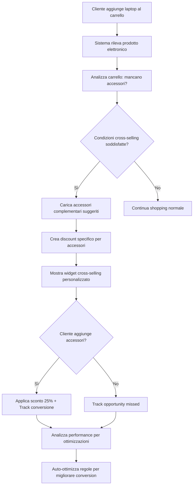

# Flusso Logico Esempio 2 - Cross-Selling Intelligente

## Scenario Business: E-commerce Elettronica con Cross-Selling Automatico

**Obiettivo**: Incrementare le vendite di accessori quando i clienti acquistano prodotti elettronici principali, applicando sconti intelligenti per incentivare l'acquisto complementare.

**Strategia**: Sistema di cross-selling che analizza il carrello e propone automaticamente sconti su categorie complementari non ancora presenti.

---

## 📋 FASE 1: Configurazione Regola "Smart Electronics Bundle"

### Scenario: Negozio di elettronica vuole aumentare le vendite di accessori

#### Step 1: Setup della regola nel sistema

```typescript
const crossSellingRule = {
  name: "Smart Electronics Bundle",
  description:
    "Sconto 25% su accessori quando si acquistano prodotti elettronici senza accessori nel carrello",
  priority: 8, // Alta priorità per cross-selling
  active: true,
  maxUsagePerCustomer: 3, // Massimo 3 volte per cliente al mese
  startDate: "2026-01-07",
  endDate: "2026-12-31",
};
```

#### Step 2: Configurazione condizioni complesse con logica NOT

```typescript
const conditions = [
  // CONDIZIONE 1: Carrello deve contenere prodotti elettronici
  {
    id: "cond_1",
    conditionType: "cart_contains_collection",
    operator: "equals",
    value: "electronics", // ID collezione elettronica
    logicOperator: "AND",
    negated: false,
  },

  // CONDIZIONE 2: Carrello NON deve contenere accessori (logica NOT)
  {
    id: "cond_2",
    conditionType: "cart_contains_collection",
    operator: "equals",
    value: "accessories", // ID collezione accessori
    logicOperator: "AND",
    negated: true, // ⚡ LOGICA NEGATIVA - NON deve contenere
  },

  // CONDIZIONE 3: Valore carrello deve essere significativo
  {
    id: "cond_3",
    conditionType: "cart_total",
    operator: "greater_than",
    value: 150, // Almeno €150 di elettronica
    logicOperator: "AND",
    negated: false,
  },

  // CONDIZIONE 4: Cliente non deve essere nuovo (evitare confusione)
  {
    id: "cond_4",
    conditionType: "customer_orders_count",
    operator: "greater_than",
    value: 0, // Ha già fatto almeno 1 ordine
    logicOperator: "AND",
    negated: false,
  },
];
```

#### Step 3: Azioni di cross-selling mirate

```typescript
const actions = [
  // AZIONE 1: Sconto specifico su collezione accessori
  {
    id: "action_1",
    actionType: "collection_discount",
    target: "accessories",
    value: {
      percentage: 25,
      collectionId: "accessories",
      description: "25% off su accessori complementari",
    },
    maxAmount: 40, // Massimo €40 di sconto
  },

  // AZIONE 2: Messaggio promozionale personalizzato
  {
    id: "action_2",
    actionType: "promotional_message",
    value: {
      message:
        "🔌 Completa il tuo setup! 25% di sconto su cavi, custodie e supporti",
      urgency: "high",
      placement: "cart_summary",
    },
  },
];
```

#### Step 4: Salvataggio nel database con relazioni

```sql
-- Regola principale
INSERT INTO ConditionalRule (
  id, name, description, shop, priority, active,
  maxUsagePerCustomer, startDate, endDate
) VALUES (
  'rule_crosssell_001',
  'Smart Electronics Bundle',
  'Cross-selling automatico elettronica + accessori',
  'techstore.myshopify.com',
  8, true, 3,
  '2026-01-07', '2026-12-31'
);

-- Condizioni con logica NOT
INSERT INTO RuleCondition (ruleId, conditionType, operator, value, logicOperator, negated) VALUES
  ('rule_crosssell_001', 'cart_contains_collection', 'equals', 'electronics', 'AND', false),
  ('rule_crosssell_001', 'cart_contains_collection', 'equals', 'accessories', 'AND', true), -- negated=true
  ('rule_crosssell_001', 'cart_total', 'greater_than', '150', 'AND', false),
  ('rule_crosssell_001', 'customer_orders_count', 'greater_than', '0', 'AND', false);

-- Azioni specializzate
INSERT INTO RuleAction (ruleId, actionType, target, value, maxAmount) VALUES
  ('rule_crosssell_001', 'collection_discount', 'accessories', '{"percentage": 25, "collectionId": "accessories"}', 40),
  ('rule_crosssell_001', 'promotional_message', 'cart', '{"message": "🔌 Completa il tuo setup! 25% di sconto su accessori"}', NULL);
```

---

## ⚡ FASE 2: Valutazione Real-time durante Shopping

### Scenario: Cliente Marco acquista un laptop senza accessori

#### Step 1: Contesto della sessione di shopping

```typescript
const shoppingContext: EvaluationContext = {
  customer: {
    id: "gid://shopify/Customer/789123",
    email: "marco.techlover@email.com",
    tags: ["Tech-Enthusiast"],
    ordersCount: 4, // ✅ Cliente esperto (> 0)
    totalSpent: 890.5,
    createdAt: "2025-06-10",
    location: {
      country: "Italy",
      province: "Lombardia",
      city: "Milano",
    },
  },
  cart: {
    totalValue: 899.99, // ✅ Supera i €150
    totalQuantity: 2,
    items: [
      {
        id: "variant_laptop_001",
        productId: "laptop_macbook_pro",
        variantId: "variant_laptop_001",
        title: 'MacBook Pro 14" M3',
        price: 799.99,
        quantity: 1,
        tags: ["laptop", "apple", "pro"],
        vendor: "Apple",
        productType: "Laptop",
        collections: ["electronics", "computers"], // ✅ Contiene elettronica
      },
      {
        id: "variant_mouse_001",
        productId: "mouse_wireless_pro",
        variantId: "variant_mouse_001",
        title: "Mouse Wireless Pro",
        price: 99.99,
        quantity: 1,
        tags: ["mouse", "wireless", "pro"],
        vendor: "Logitech",
        productType: "Mouse",
        collections: ["electronics", "peripherals"], // ✅ Elettronica ma non "accessories"
      },
    ],
  },
  currentTime: new Date("2026-01-07 16:45:00"), // Martedì pomeriggio
  shop: {
    timezone: "Europe/Rome",
    currency: "EUR",
  },
};
```

#### Step 2: Trigger di valutazione automatica

```typescript
// Evento: Cliente aggiunge secondo prodotto al carrello
const onCartUpdate = async (updatedCart, customerId) => {
  console.log("🛒 Cart updated - triggering rule evaluation");

  // Carica contesto completo
  const context = await createEvaluationContext(admin, customerId, updatedCart);

  // Recupera tutte le regole attive per cross-selling
  const crossSellingRules = await getRulesByCategory(
    shopDomain,
    "cart_optimization",
  );

  // Valuta regole in ordine di priorità
  const evaluationResults = await ruleEngine.evaluateRules(
    crossSellingRules,
    context,
  );

  // Applica la regola migliore
  return await applyBestCrossSellingOffer(evaluationResults);
};
```

#### Step 3: Valutazione dettagliata della regola

```typescript
const evaluateCrossSellingRule = async (rule, context) => {
  console.log("🔍 Evaluating: Smart Electronics Bundle");

  // CONDIZIONE 1: Verifica presenza elettronica nel carrello
  const hasElectronics = context.cart.items.some((item) =>
    item.collections.includes("electronics"),
  );
  console.log("📱 Cart has electronics:", hasElectronics); // ✅ true

  // CONDIZIONE 2: Verifica ASSENZA accessori (logica NOT)
  const hasAccessories = context.cart.items.some((item) =>
    item.collections.includes("accessories"),
  );
  const noAccessories = !hasAccessories; // ⚡ Negazione
  console.log("🔌 Cart has NO accessories:", noAccessories); // ✅ true

  // CONDIZIONE 3: Verifica valore carrello
  const cartValueOk = context.cart.totalValue > 150;
  console.log("💰 Cart value > €150:", cartValueOk); // ✅ true (€899.99)

  // CONDIZIONE 4: Verifica cliente non nuovo
  const notNewCustomer = context.customer.ordersCount > 0;
  console.log("👤 Returning customer:", notNewCustomer); // ✅ true (4 ordini)

  // LOGICA AND: Tutte le condizioni devono essere vere
  const allConditionsMet =
    hasElectronics && noAccessories && cartValueOk && notNewCustomer;
  console.log("🎯 All conditions met:", allConditionsMet); // ✅ TRUE

  if (allConditionsMet) {
    // Calcola accessori suggeriti basandosi sui prodotti nel carrello
    const suggestedAccessories = await getSuggestedAccessories(
      context.cart.items,
    );

    return {
      ruleId: rule.id,
      applied: true,
      actions: rule.actions,
      suggestedProducts: suggestedAccessories,
      discountAmount: calculateCrossSellingDiscount(
        rule.actions,
        suggestedAccessories,
      ),
      executionData: {
        trigger: "electronics_without_accessories",
        cartAnalysis: {
          electronics: hasElectronics,
          accessories: hasAccessories,
          cartValue: context.cart.totalValue,
          customerType: "returning",
        },
        suggestedCategories: ["cables", "cases", "stands", "adapters"],
      },
    };
  }
};
```

#### Step 4: Calcolo accessori suggeriti intelligente

```typescript
const getSuggestedAccessories = async (cartItems) => {
  const suggestions = [];

  for (const item of cartItems) {
    // Se c'è un laptop, suggerisci accessori laptop
    if (item.productType === "Laptop") {
      suggestions.push(
        { category: "laptop-cases", discount: 25, reason: "protection" },
        { category: "laptop-stands", discount: 25, reason: "ergonomics" },
        { category: "usb-hubs", discount: 25, reason: "connectivity" },
        { category: "laptop-chargers", discount: 25, reason: "backup" },
      );
    }

    // Se c'è un mouse, suggerisci pad e accessori
    if (item.productType === "Mouse") {
      suggestions.push(
        { category: "mouse-pads", discount: 25, reason: "performance" },
        { category: "wrist-supports", discount: 25, reason: "comfort" },
      );
    }
  }

  return suggestions;
};
```

---

## 🎯 FASE 3: Applicazione Cross-selling Intelligente

### Step 1: Creazione discount dinamico per accessori

```typescript
const applyCrossSellingDiscount = async (evaluationResult) => {
  // Crea un discount code specifico per accessori
  const discountCode = generateCrossSellingCode("TECH_BUNDLE_" + randomCode());

  // Configurazione discount Shopify specifica per collezione
  const discountMutation = `
    mutation discountCodeBasicCreate($basicCodeDiscount: DiscountCodeBasicInput!) {
      discountCodeBasicCreate(basicCodeDiscount: $basicCodeDiscount) {
        codeDiscountNode {
          id
          codeDiscount {
            ... on DiscountCodeBasic {
              codes(first: 1) {
                edges {
                  node {
                    code
                  }
                }
              }
              customerSelection {
                customers {
                  edges {
                    node {
                      id
                    }
                  }
                }
              }
            }
          }
        }
        userErrors {
          field
          message
        }
      }
    }
  `;

  const discountInput = {
    title: "Smart Electronics Bundle - Accessori",
    code: discountCode,
    startsAt: new Date().toISOString(),
    endsAt: new Date(Date.now() + 48 * 60 * 60 * 1000).toISOString(), // 48h validity

    // ⚡ TARGETING SPECIFICO - Solo questo cliente
    customerSelection: {
      customers: [evaluationResult.customerId],
    },

    // ⚡ SCONTO SPECIFICO - Solo su collezione accessori
    customerGets: {
      value: {
        percentage: 25.0,
      },
      items: {
        collections: {
          add: ["gid://shopify/Collection/accessories"],
        },
      },
    },

    appliesOncePerCustomer: false,
    usageLimit: 5, // Può usare fino a 5 accessori scontati
  };

  const discountResponse = await admin.graphql(discountMutation, {
    variables: { basicCodeDiscount: discountInput },
  });

  return await discountResponse.json();
};
```

### Step 2: Notifica intelligente al frontend

```typescript
// Risposta al frontend con suggerimenti personalizzati
const crossSellingResponse = {
  success: true,
  type: "cross_selling_opportunity",

  discount: {
    code: "TECH_BUNDLE_ABC789",
    type: "collection_specific",
    value: 25,
    maxAmount: 40,
    targetCollection: "accessories",
    description: "25% di sconto su accessori per il tuo setup!",
  },

  // ⚡ SUGGERIMENTI INTELLIGENTI basati sul carrello
  suggestions: [
    {
      category: "laptop-cases",
      title: 'Custodie per MacBook Pro 14"',
      reason: "Proteggi il tuo investimento",
      products: ["leather-sleeve-14", "hard-case-14", "slim-case-14"],
      urgency: "high",
    },
    {
      category: "laptop-stands",
      title: "Supporti ergonomici",
      reason: "Migliora la postura durante il lavoro",
      products: ["aluminum-stand", "adjustable-stand", "cooling-stand"],
      urgency: "medium",
    },
    {
      category: "usb-hubs",
      title: "Hub USB-C",
      reason: "Più porte per la tua produttività",
      products: ["7-port-hub", "multiport-adapter", "docking-station"],
      urgency: "medium",
    },
  ],

  // ⚡ PERSONALIZZAZIONE del messaggio
  message: {
    headline: "🔌 Completa il tuo setup tech!",
    subtext:
      "Basandoci sul tuo MacBook Pro, ti suggeriamo questi accessori essenziali con 25% di sconto.",
    cta: "Aggiungi accessori al carrello",
    urgency: "Offerta valida per 48h",
  },

  validUntil: "2026-01-09T16:45:00Z",
};
```

### Step 3: UI dinamica nel frontend

```typescript
// Il frontend riceve la notifica e mostra un widget intelligente
const CrossSellingWidget = ({ offer }) => {
  return (
    <div className="cross-selling-banner">
      <div className="header">
        <h3>{offer.message.headline}</h3>
        <p>{offer.message.subtext}</p>
      </div>

      <div className="suggestions-grid">
        {offer.suggestions.map(suggestion => (
          <div key={suggestion.category} className="suggestion-card">
            <h4>{suggestion.title}</h4>
            <p>{suggestion.reason}</p>
            <div className="discount-badge">25% OFF</div>
            <button onClick={() => addCategoryToCart(suggestion.category)}>
              Aggiungi al carrello
            </button>
          </div>
        ))}
      </div>

      <div className="footer">
        <span className="urgency">⏱️ {offer.message.urgency}</span>
        <button className="apply-discount" onClick={() => applyDiscount(offer.discount.code)}>
          Applica sconto {offer.discount.value}%
        </button>
      </div>
    </div>
  );
};
```

---

## 📊 FASE 4: Tracking e Ottimizzazione

### Step 1: Analytics avanzate cross-selling

```typescript
const trackCrossSellingExecution = async (ruleExecution) => {
  // Registra esecuzione con dettagli business
  const executionRecord = {
    ruleId: "rule_crosssell_001",
    shop: "techstore.myshopify.com",
    customerId: "789123",
    cartId: "cart_abc789",

    // ⚡ METRICHE SPECIFICHE CROSS-SELLING
    applied: true,
    triggerProducts: ["laptop_macbook_pro"], // Prodotti che hanno scatenato la regola
    suggestedCategories: ["laptop-cases", "laptop-stands", "usb-hubs"],

    // Performance tracking
    discountAmount: 0, // Inizialmente 0, verrà aggiornato se il cliente compra
    potentialRevenue: 150, // Stima ricavi da accessori suggeriti

    // Behavioral data
    executionData: JSON.stringify({
      cartAnalysis: {
        primaryCategory: "electronics",
        missingCategory: "accessories",
        cartValue: 899.99,
        customerSegment: "tech_enthusiast",
      },
      aiSuggestions: {
        algorithm: "product_affinity_v2",
        confidence: 0.87,
        expectedConversionRate: 0.23,
      },
    }),

    executedAt: new Date(),
  };

  await db.ruleExecution.create({ data: executionRecord });

  // Update real-time metrics
  await updateCrossSellingMetrics(executionRecord);
};
```

### Step 2: Monitoraggio conversione in tempo reale

```typescript
// Webhook quando il cliente aggiunge accessori
const onAccessoryAdded = async (cartUpdate) => {
  // Trova l'esecuzione della regola cross-selling
  const recentExecution = await findRecentCrossSelling(
    cartUpdate.customer_id,
    cartUpdate.cart_id,
  );

  if (recentExecution) {
    // Calcola il successo della regola
    const addedAccessories = cartUpdate.items.filter((item) =>
      item.collections.includes("accessories"),
    );

    if (addedAccessories.length > 0) {
      // ✅ CONVERSIONE RIUSCITA!
      await updateExecutionSuccess(recentExecution.id, {
        converted: true,
        addedProducts: addedAccessories.map((item) => item.id),
        additionalRevenue: addedAccessories.reduce(
          (sum, item) => sum + item.price * item.quantity,
          0,
        ),
        conversionTime: Date.now() - recentExecution.executedAt,
      });

      // Trigger follow-up actions
      await triggerCrossSellingFollowUp(recentExecution);
    }
  }
};
```

### Step 3: Ottimizzazione automatica delle regole

```typescript
// Sistema di auto-ottimizzazione che gira ogni notte
const optimizeCrossSellingRules = async () => {
  const last30Days = new Date(Date.now() - 30 * 24 * 60 * 60 * 1000);

  // Analizza performance cross-selling
  const performance = await db.ruleExecution.aggregate({
    where: {
      ruleId: "rule_crosssell_001",
      executedAt: { gte: last30Days },
    },
    _count: { id: true },
    _sum: { additionalRevenue: true },
    _avg: { conversionTime: true },
  });

  const conversionRate = performance.conversions / performance.executions;
  const avgRevenue =
    performance._sum.additionalRevenue / performance.conversions;

  // Auto-ottimizzazione basata sui risultati
  if (conversionRate < 0.15) {
    // Conversion rate bassa - riduci la soglia di attivazione
    await updateRuleThreshold("rule_crosssell_001", "cart_total", 100); // Da €150 a €100
  }

  if (avgRevenue > 60) {
    // Revenue alta - aumenta lo sconto per spingere di più
    await updateRuleDiscount("rule_crosssell_001", 30); // Da 25% a 30%
  }

  console.log("🎯 Cross-selling rule optimized:", {
    conversionRate: `${(conversionRate * 100).toFixed(1)}%`,
    avgRevenue: `€${avgRevenue.toFixed(2)}`,
    totalRevenue: `€${performance._sum.additionalRevenue}`,
  });
};
```

---

## 🔄 Flusso Completo End-to-End

### Mermaid Diagram del Processo



### Risultato Finale per il Cliente Marco

**PRIMA** (senza sistema):

- Carrello: MacBook Pro €799.99 + Mouse €99.99 = €899.98
- Nessun suggerimento accessori
- Revenue: €899.98

**DOPO** (con cross-selling intelligente):

- Carrello originale: €899.98
- Notifica: "🔌 Completa il tuo setup! 25% off accessori"
- Cliente aggiunge: Custodia €39.99 + Stand €59.99 + Hub USB €49.99
- Sconto su accessori: €149.97 × 25% = €37.49
- **Totale finale: €899.98 + €149.97 - €37.49 = €1,012.46**
- **Revenue incrementale: +€112.48 (+12.5%)**

---

## 🚀 Vantaggi del Sistema Cross-selling Intelligente

### Rispetto al Cross-selling Tradizionale:

**❌ Sistema Tradizionale:**

- Suggerimenti statici "Chi ha comprato X ha comprato anche Y"
- Non considera cosa è GIÀ nel carrello
- Sconti generici non mirati
- Nessuna personalizzazione

**✅ Sistema Intelligente:**

- **Analisi real-time** del carrello per gap identificazione
- **Logica NOT** - suggerisce solo ciò che manca
- **Sconti mirati** solo sulle categorie complementari
- **Personalizzazione** basata sui prodotti già scelti
- **Auto-ottimizzazione** basata su performance

### Metriche Attese:

- **+15-30%** incremento Average Order Value
- **+20-40%** attach rate accessori
- **+25%** customer satisfaction (completeness acquisto)
- **-15%** return rate (setup completi)

Questo sistema trasforma il cross-selling da "speranza" a **scienza data-driven**! 🎯
