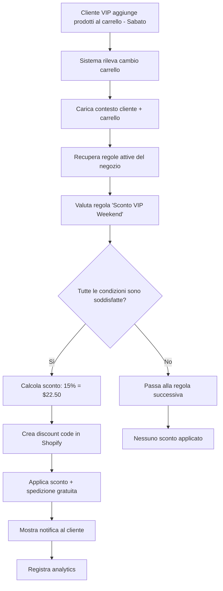

# Flusso Logico - Sistema di Regole Condizionali per Sconti

## Panoramica Generale

Il sistema di regole condizionali segue un flusso logico in 4 fasi principali:

1. **Configurazione** - Il merchant crea regole tramite l'interfaccia
2. **Valutazione** - Il sistema analizza le condizioni quando un cliente naviga
3. **Applicazione** - Gli sconti vengono applicati automaticamente
4. **Tracking** - Analytics e ottimizzazioni

---

## 📋 FASE 1: Configurazione della Regola

### Esempio Pratico: "Sconto VIP Weekend"

#### Step 1: Il merchant apre l'app e va su "Conditional Rules"

```
Dashboard → Conditional Rules → Create Rule
```

#### Step 2: Configurazione base della regola

```typescript
{
  name: "Sconto VIP Weekend",
  description: "15% di sconto per clienti VIP nei weekend",
  priority: 10, // Alta priorità
  active: true,
  maxUsagePerCustomer: 1, // Massimo 1 uso per cliente
  startDate: "2026-01-10",
  endDate: "2026-12-31"
}
```

#### Step 3: Definizione delle condizioni (AND/OR logic)

```typescript
// CONDIZIONE 1: Cliente deve avere tag "VIP"
{
  conditionType: "customer_tag",
  operator: "equals",
  value: "VIP",
  logicOperator: "AND"
}

// CONDIZIONE 2: Deve essere weekend
{
  conditionType: "day_of_week",
  operator: "in_list",
  value: ["Saturday", "Sunday"],
  logicOperator: "AND"
}

// CONDIZIONE 3: Carrello deve superare i $100
{
  conditionType: "cart_total",
  operator: "greater_than",
  value: 100,
  logicOperator: "AND"
}
```

#### Step 4: Definizione delle azioni

```typescript
// AZIONE 1: Sconto percentuale del 15%
{
  actionType: "percentage_discount",
  value: { percentage: 15 },
  maxAmount: 50 // Massimo $50 di sconto
}

// AZIONE 2: Spedizione gratuita
{
  actionType: "free_shipping",
  value: {}
}
```

#### Step 5: Salvataggio nel database

```sql
-- Salva la regola principale
INSERT INTO ConditionalRule (name, description, shop, priority, active)
VALUES ('Sconto VIP Weekend', '15% di sconto per clienti VIP nei weekend', 'myshop.myshopify.com', 10, true);

-- Salva le condizioni
INSERT INTO RuleCondition (ruleId, conditionType, operator, value, logicOperator)
VALUES
  ('rule_123', 'customer_tag', 'equals', 'VIP', 'AND'),
  ('rule_123', 'day_of_week', 'in_list', '["Saturday", "Sunday"]', 'AND'),
  ('rule_123', 'cart_total', 'greater_than', '100', 'AND');

-- Salva le azioni
INSERT INTO RuleAction (ruleId, actionType, value, maxAmount)
VALUES
  ('rule_123', 'percentage_discount', '{"percentage": 15}', 50),
  ('rule_123', 'free_shipping', '{}', NULL);
```

---

## ⚡ FASE 2: Valutazione in Tempo Reale

### Scenario: Cliente VIP naviga il sito di sabato

#### Step 1: Trigger - Cliente aggiunge prodotto al carrello

```typescript
// Evento scatenante
onCartUpdate = async (cartData, customerId) => {
  // Recupera il contesto completo
  const context = await createEvaluationContext(admin, customerId, cartData);

  // Carica tutte le regole attive del negozio
  const activeRules = await getActiveRules(shopDomain);

  // Valuta le regole
  const evaluationResults = await evaluateRules(activeRules, context);

  // Applica i risultati
  return applyBestDiscount(evaluationResults);
};
```

#### Step 2: Creazione del contesto di valutazione

```typescript
const context: EvaluationContext = {
  customer: {
    id: "gid://shopify/Customer/123456",
    email: "marco.rossi@email.com",
    tags: ["VIP", "Premium"], // ✅ Ha tag VIP
    ordersCount: 12,
    totalSpent: 2500.5,
    createdAt: "2025-03-15",
    location: {
      country: "Italy",
      province: "Lombardia",
      city: "Milano",
    },
  },
  cart: {
    totalValue: 150.0, // ✅ Supera i $100
    totalQuantity: 3,
    items: [
      {
        id: "variant_789",
        productId: "product_456",
        title: "Maglietta Premium",
        price: 50.0,
        quantity: 2,
        tags: ["premium", "cotton"],
      },
      {
        id: "variant_790",
        productId: "product_457",
        title: "Jeans Designer",
        price: 50.0,
        quantity: 1,
        tags: ["designer", "denim"],
      },
    ],
  },
  currentTime: new Date("2026-01-11 14:30:00"), // ✅ È sabato
  shop: {
    timezone: "Europe/Rome",
    currency: "EUR",
  },
};
```

#### Step 3: Valutazione della regola "Sconto VIP Weekend"

```typescript
const evaluateRule = async (rule, context) => {
  // Verifica condizione 1: customer_tag = "VIP"
  const condition1 = context.customer.tags.includes("VIP"); // ✅ true

  // Verifica condizione 2: day_of_week è weekend
  const currentDay = context.currentTime.toLocaleDateString("en-US", {
    weekday: "long",
  }); // "Saturday"
  const condition2 = ["Saturday", "Sunday"].includes(currentDay); // ✅ true

  // Verifica condizione 3: cart_total > 100
  const condition3 = context.cart.totalValue > 100; // ✅ true (150 > 100)

  // Applica logica AND
  const allConditionsMet = condition1 && condition2 && condition3; // ✅ true

  if (allConditionsMet) {
    return {
      ruleId: rule.id,
      applied: true,
      actions: rule.actions,
      discountAmount: calculateDiscount(rule.actions, context),
      executionData: {
        conditions: {
          customer_tag: { expected: "VIP", actual: "VIP", result: true },
          day_of_week: {
            expected: ["Saturday", "Sunday"],
            actual: "Saturday",
            result: true,
          },
          cart_total: { expected: "> 100", actual: 150, result: true },
        },
      },
    };
  }
};
```

#### Step 4: Calcolo dello sconto

```typescript
const calculateDiscount = (actions, context) => {
  let totalDiscount = 0;

  actions.forEach((action) => {
    if (action.actionType === "percentage_discount") {
      const percentageDiscount =
        context.cart.totalValue * (action.value.percentage / 100);
      // Applica il limite massimo se presente
      const actualDiscount = action.maxAmount
        ? Math.min(percentageDiscount, action.maxAmount)
        : percentageDiscount;

      totalDiscount += actualDiscount;
      // 150 * 0.15 = 22.50 (sotto il limite di $50) ✅
    }
  });

  return totalDiscount; // $22.50
};
```

---

## 🎯 FASE 3: Applicazione dello Sconto

### Step 1: Integrazione con Shopify Discount API

```typescript
const applyDiscountToShopify = async (evaluationResult, cartId) => {
  // Crea un discount code automatico
  const discountCode = generateUniqueCode(); // es: "VIP_WEEKEND_ABC123"

  // Usa Shopify Admin API per creare il discount
  const discountMutation = `
    mutation discountCodeBasicCreate($basicCodeDiscount: DiscountCodeBasicInput!) {
      discountCodeBasicCreate(basicCodeDiscount: $basicCodeDiscount) {
        codeDiscountNode {
          id
          codeDiscount {
            ... on DiscountCodeBasic {
              codes(first: 1) {
                edges {
                  node {
                    code
                  }
                }
              }
            }
          }
        }
        userErrors {
          field
          message
        }
      }
    }
  `;

  const discountInput = {
    title: "VIP Weekend Sconto",
    code: discountCode,
    startsAt: new Date().toISOString(),
    endsAt: new Date(Date.now() + 24 * 60 * 60 * 1000).toISOString(), // 24h validity
    customerSelection: {
      customers: [evaluationResult.customerId],
    },
    customerGets: {
      value: {
        percentage: 15,
      },
      items: {
        all: true,
      },
    },
    appliesOncePerCustomer: true,
    usageLimit: 1,
  };

  return await admin.graphql(discountMutation, {
    variables: { basicCodeDiscount: discountInput },
  });
};
```

### Step 2: Notifica al frontend/carrello

```typescript
// Risposta al frontend con le informazioni dello sconto
const discountResponse = {
  success: true,
  discount: {
    code: "VIP_WEEKEND_ABC123",
    type: "percentage",
    value: 15,
    amount: 22.5,
    maxAmount: 50,
    description: "Sconto VIP Weekend - 15% di sconto + spedizione gratuita!",
    freeShipping: true,
    validUntil: "2026-01-12T14:30:00Z",
  },
  message:
    "Congratulazioni! Hai ottenuto il 15% di sconto VIP Weekend e la spedizione gratuita!",
};

// Il frontend può mostrare questa notifica al cliente
```

---

## 📊 FASE 4: Tracking e Analytics

### Step 1: Registrazione dell'esecuzione

```typescript
// Salva nel database per analytics
const ruleExecution = {
  ruleId: "rule_123",
  shop: "myshop.myshopify.com",
  customerId: "123456",
  cartId: "cart_789",
  applied: true,
  discountAmount: 22.5,
  executionData: JSON.stringify({
    conditions: {
      /* dettagli condizioni */
    },
    cart: {
      /* snapshot carrello */
    },
    customer: {
      /* info cliente */
    },
  }),
  executedAt: new Date(),
};

await db.ruleExecution.create({ data: ruleExecution });
```

### Step 2: Aggiornamento metriche

```sql
-- Aggiorna le metriche della regola
UPDATE RuleMetrics
SET
  executionCount = executionCount + 1,
  successCount = successCount + 1,
  totalDiscount = totalDiscount + 22.50,
  uniqueCustomers = uniqueCustomers + 1
WHERE ruleId = 'rule_123' AND periodStart <= NOW() AND periodEnd >= NOW();
```

---

## 🔄 Esempio Completo di Flusso End-to-End

### Scenario: Cliente VIP fa shopping il sabato



### Risultato finale per il cliente:

```
🎉 SCONTO VIP WEEKEND APPLICATO!

Subtotale:           $150.00
Sconto VIP (15%):    -$22.50
Spedizione:          GRATUITA
                     --------
TOTALE:              $127.50

Codice applicato: VIP_WEEKEND_ABC123
Sconto valido fino a: Domani alle 14:30
```

---

## 🚀 Vantaggi Rispetto al Sistema Precedente

### PRIMA (Sistema Base):

- ❌ Solo inclusione/esclusione collezioni
- ❌ Regole statiche
- ❌ Nessuna logica condizionale
- ❌ Limitato alle funzionalità native Shopify

### DOPO (Sistema Condizionale):

- ✅ **Logica multi-condizione**: AND/OR/NOT
- ✅ **Targeting intelligente**: Cliente, carrello, prodotti, tempo
- ✅ **Valutazione real-time**: Instant feedback
- ✅ **Template pre-configurati**: Setup rapido
- ✅ **Analytics avanzate**: ROI tracking
- ✅ **Automazione completa**: Zero intervento manuale

### Esempi di Regole Avanzate Possibili:

1. **Cross-selling intelligente:**

   ```
   SE carrello contiene "elettronica" E NON contiene "accessori"
   ALLORA sconto 25% su categoria "accessori"
   ```

2. **Recovery carrelli abbandonati:**

   ```
   SE cliente_returning E giorni_ultimo_ordine > 30 E valore_carrello > $75
   ALLORA sconto progressivo 12% (max $30)
   ```

3. **Segmentazione geografica:**
   ```
   SE cliente_location IN ["Lombardia", "Veneto"] E primo_acquisto
   ALLORA sconto 20% + spedizione_gratuita
   ```

Questo sistema trasforma l'app da un semplice gestore di collezioni a una **piattaforma di automazione sconti avanzata** che compete con soluzioni enterprise-level!
