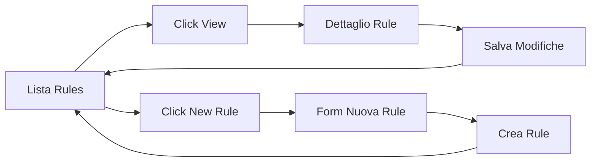

# ✅ Sistema di Gestione Rules Refactored

## **Implementazione Completata**

### 1. **Nuova Architettura**

- ✅ **Pagina Lista Rules**: `/app/rules` - Solo visualizzazione e gestione (delete, toggle)
- ✅ **Pagina Dettaglio**: `/app/rules/{ruleId}` - Creazione e modifica
- ✅ **Pagina Nuova Rule**: `/app/rules/new` - Stesso componente per creare

### 2. **File Modificati**

#### **Routes**

- ✅ `app/routes/app.rules.tsx` - Semplificata, solo lista
- ✅ `app/routes/app.rules.$ruleId.tsx` - Nuova route per dettaglio/creazione

#### **Componenti**

- ✅ `app/components/MultipleRulesList.tsx` - Pulsante "View" naviga a dettaglio
- ✅ `app/components/RulesHeader.tsx` - Pulsante "New Rule" naviga a `/app/rules/new`

#### **Servizi**

- ✅ `app/services/db.server.ts` - Aggiunta funzione `getRuleById()`

### 3. **Flusso Utente**

### 4. **Navigazione**

- ✅ Pulsante "View" in lista → `/app/rules/{ruleId}`
- ✅ Pulsante "New Rule" in header → `/app/rules/new`
- ✅ Stesso componente gestisce edit e create
- ✅ BackAction torna sempre alla lista

### 5. **Vantaggi**

- **Separazione responsabilità**: Lista vs Dettaglio
- **URL navigabili**: Ogni rule ha URL dedicato
- **Riusabilità**: Stesso form per edit/create
- **UX migliorata**: Operazioni isolate
- **Meno stato**: Niente modali o form nascosti

### 6. **Test**

- ✅ Build riuscita senza errori
- ✅ TypeScript compilato correttamente
- ✅ Routing configurato automaticamente

## **Ready for Testing** 🚀

L'utente può ora:

1. Vedere lista rules in `/app/rules`
2. Cliccare "View" per aprire `/app/rules/{id}`
3. Cliccare "New Rule" per aprire `/app/rules/new`
4. Editare/creare rules in pagina dedicata
5. Tornare alla lista con BackAction

Il sistema è ora **più organizzato**, **scalabile** e **user-friendly**!
